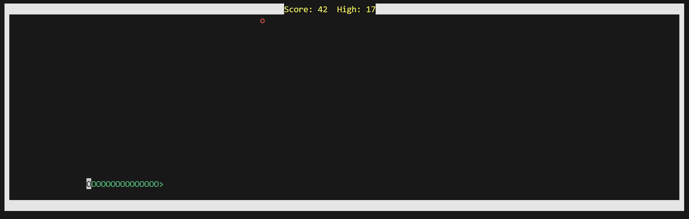

# Snake Game in C++

A console-based Snake Game implemented in C++. This project simulates the classic snake game where the player controls a snake to eat food, grow in size, and avoid collisions with itself. It includes normal and special food items, score tracking, and dynamic gameplay.

**GamePlay Screenshot:**



---

## Table of Contents
- [Features](#features)
- [File Structure](#file-structure)
- [Installation](#installation)
- [How to Play](#how-to-play)
- [Game Mechanics](#game-mechanics)
- [Dependencies](#dependencies)

---

## Features
- Snake movement using **Arrow Keys** or **WASD**.

- **Normal Food** ('o') adds +1 score, increases snake length.

- **Special Food** ('#') appears every 10 seconds, blinks in colors, worth +10 score.

- **Wrap-around screen:** Snake can move through one wall and appear on the opposite side.

- Persistent **High Score** saved in a text file.

- Start screen and end screen messages.

---

## File Structure
**Snake-Game/SnakeGame/**
```bash 
# Main game code
    - snake.cpp 
# sanke.exe will be formed upon compilation
    - sanke.exe
# Precise information about the Game:
    - ReadMe.md
# Previous high score will be maintained:
    - highscore.txt        
```
- The Folder also has a snake.exe file present in .gitignore which is expected to be made by the user.


---

## Installation

```bash
1. Clone the repository:
    - git clone <your-repo-url>

2. Select the folder:    
    - cd SnakeGame

3. Complie the code using C++:
    - g++ snake.cpp -o snake.exe

4. Run the Game:
    # Windows  
    snake.exe

    # Linux / Mac
    ./snake
```
---
## Code Explanation
**Key Components**

1. Point Structure:

    - Represents (x, y) coordinates on the console.

2. Snake Class:

    - Maintains the snake's body (array of Points), length, and direction.

    - Handles movement, collision detection, food consumption, and growth.

3. Board Class:

    - Manages snake object, food spawning, rendering, score, and game logic.

    - Handles special food mechanics (timed appearance, blinking).

    - Loads/saves high score.

4. Main Function:

    - Initializes console screen size.

    - Creates board instance, shows start screen, runs the game loop.

    - Ends when snake collides with itself.

## Workflow

The game follows a continuous loop until the snake dies:
```
1. Start / Input Handling → User presses keys to set direction.

2. Update Snake Position → Snake head moves; body follows.

3. Check Collision → Detects food, special food, or self-collision.

4. Update Score & Grow Snake → If food eaten, increase score and length.

5. Render Board & Snake → Draws updated state.

6. Loop Back → Repeats until collision ends game.
```
---
## Dependencies

- C++ Compiler: g++, clang++, or any compiler supporting C++11 or higher.

- Windows Only: Uses <conio.h> and <windows.h> for input handling.

- Cross-platform adaptation may require modifying input and timing functions.